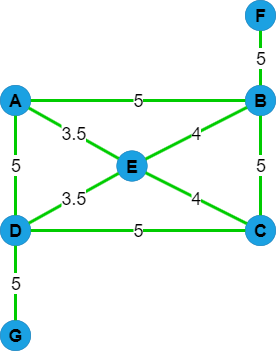

# Traveling Salesman Problem
###### An attemp to solve the Traveling Salesman problem using Brute Force.

the algorithm uses BFS at every step and creates a new route from the neighboring nodes/points of the current node/point.

#### Example : 

#### Result :
<pre>
A : No Hamiltonian Path Found
B : No Hamiltonian Path Found
C : No Hamiltonian Path Found
D : No Hamiltonian Path Found
E : No Hamiltonian Path Found
F : [F, B, A, E, C, D, G] => len = 27.5
G : [G, D, A, E, C, B, F] => len = 27.5

No virtual environment used hence no requirements.txt file.